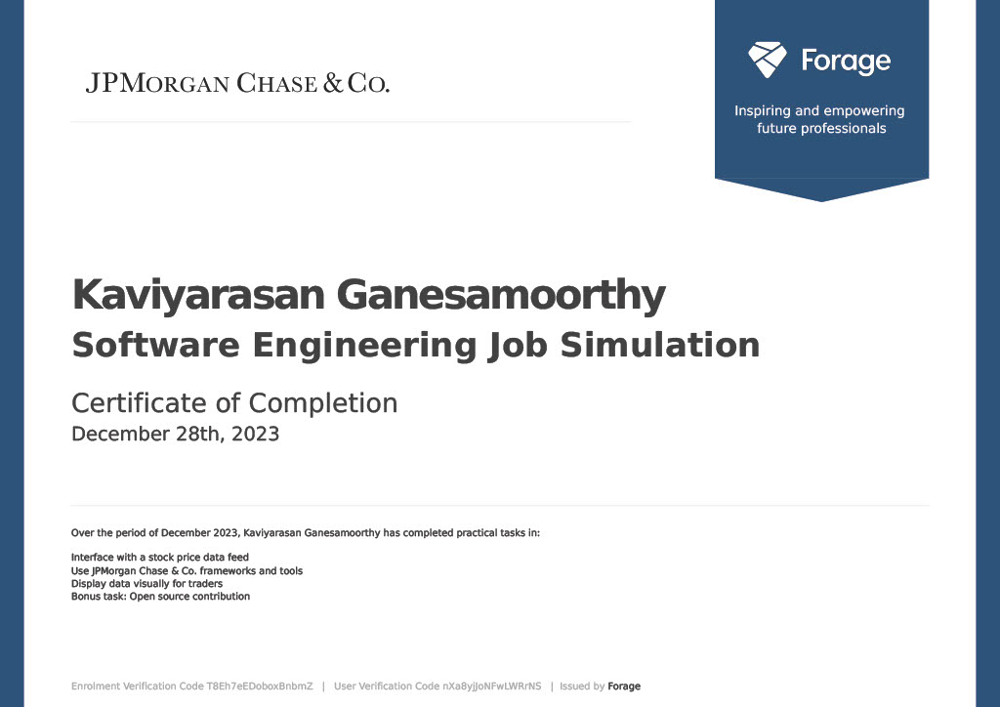

### Data Science Essentials Suite
***Issuing Platform: Coursera*** 
***Date of Completion: Jan 2024***

I am delighted to announce the successful completion of the Data Science Essentials Suite offered by the Thomas J. Watson College of Engineering and Applied Science. This suite encompassed four comprehensive courses, equipping me with a robust foundation in key areas of data science.

## Courses Completed:

**1.probability for Data Science:** Explored fundamental probability concepts crucial for data analysis and decision-making under the guidance of Prof. Anand Seetharam.

**2.Introduction to Algorithms:** Acquired a deep understanding of algorithmic thinking and efficient problem-solving strategies with Prof. Anand Seetharam.

**3.Introduction to Python Programming:** Developed essential coding skills in Python, a cornerstone language in the data science landscape, with Prof. Hiroki Sayama.

**4.Introduction to Machine Learning:** Explored the fascinating world of machine learning, understanding algorithms and techniques for predictive analysis with Prof. Arti Ramesh.

I am excited about the knowledge and skills gained throughout this comprehensive suite, and I look forward to applying them in real-world data science scenarios. This accomplishment marks a significant milestone in my journey towards becoming a proficient data scientist.

### Excel Skills for Data Analytics
***Issuing Platform: Binghamton University*** 
***Date of Completion: Oct 2023***

I possess advanced skills in utilizing Microsoft Excel for data analytics, enabling me to manipulate, analyze, and visualize data effectively. Here is an overview of my Excel proficiency:

#### Skills Demonstrated:

- **Data Cleaning and Transformation:** Expertise in cleaning and transforming raw data into structured formats suitable for analysis.

- **Data Analysis Functions:** Proficient in using various Excel functions for statistical analysis, including VLOOKUP, HLOOKUP, INDEX-MATCH, and more.

- **Pivot Tables and Pivot Charts:** Mastery in creating dynamic pivot tables and pivot charts to summarize and visualize complex datasets.

- **Data Visualization:** Skillful in designing visually compelling charts and graphs to communicate insights from data effectively.

- **Formulae and Macros:** Experience in creating and implementing complex formulas and macros to automate repetitive tasks and enhance data processing efficiency.

- **Data Validation and Quality Assurance:** Ensured data accuracy and reliability through effective use of data validation and quality assurance techniques.

My Excel skills have proven instrumental in extracting meaningful insights from data, contributing to informed decision-making processes. I am dedicated to applying these skills in real-world scenarios to drive efficiency and optimize data-driven strategies.

### Introduction to Databases for Back-End Development
***Issuing Platform: coursera*** 
***Date of Completion: Jan 2024***

I have a solid foundation in database management for back-end development, with a focus on designing and optimizing databases to support robust web applications. Here's an overview of my skills and knowledge in this domain:

#### Database Technologies:

- **Relational Databases:** Proficient in designing and working with relational databases such as MySQL and PostgreSQL. Experienced in creating normalized database schemas to ensure data integrity.

- **SQL Querying:** Skilled in writing complex SQL queries to retrieve, update, and manipulate data efficiently. Well-versed in optimizing queries for performance.

- **Database Modeling:** Experience in conceptualizing and creating database models using tools like Entity-Relationship Diagrams (ERD) to represent relationships between entities.

- **Normalization and Denormalization:** Understanding of normalization principles to eliminate data redundancy and enhance database efficiency. Familiarity with scenarios where denormalization is applied for performance optimization.

- **NoSQL Databases:** Basic knowledge of NoSQL databases like MongoDB, understanding their use cases, and ability to work with non-relational data structures.

### Introduction to Back-End Development
***Issuing Platform: Binghamton University*** 
***Date of Completion: Jan 2024***

**Course Overview:**
This course provided a foundational understanding of back-end development, covering HTML, CSS, and an introduction to UI frameworks like Bootstrap. It emphasized core internet technologies and their significance in web development.

**Key Learnings:**
- Proficiency in HTML5 and CSS for webpage creation and styling
- Introduction to UI frameworks, specifically Bootstrap
- Insight into back-end development basics and React framework

**Project Showcase:**
Included in the course was the creation and styling of a biographical webpage, demonstrating practical application of acquired skills. [Add a link or screenshots here if applicable.]

**Personal Reflection:**
The course significantly contributed to my comprehension of back-end development fundamentals. It solidified my grasp of HTML, CSS, and laid the groundwork for exploring more advanced topics in web development.

### Version Control
***Issuing Platform: Coursera*** 
***Date of Completion: Jan 2024***

#### Course Overview:
The Version Control course provided a comprehensive understanding of modern software collaboration methods, emphasizing version control systems, command-line proficiency, and Git utilization in software development projects.

#### Learning Outcomes:
- Implemented Version Control systems effectively
- Navigated and configured using the command line proficiently
- Managed code revisions efficiently
- Created and utilized GitHub repositories

#### Key Modules:
- Software Collaboration
- Command Line
- Git & GitHub

#### Note:
Successfully completed the Version Control course, gaining practical skills in software collaboration and efficient code management.

### J.P. Morgan Software Engineering Virtual Experience
***Date: December 2023*** 
***Platform: Forage***

#### Experience Highlights:
- Set up a local development environment by downloading required files, tools, and dependencies.
- Resolved broken files in the repository, ensuring proper functionality of the web application output.
- Utilized JPMorgan Chase's open-source library, Perspective, to create live graphs for traders to visually monitor data feeds.

#### Key Achievements:
- Established a functional local dev environment for project work.
- Successfully debugged broken files, ensuring the correct output of the web application.
- Implemented live graph generation using Perspective, enhancing data visualization for traders.

#### Notes:
Engaged in the J.P. Morgan Software Engineering Virtual Experience via Forage, gaining hands-on experience in setting up development environments, troubleshooting code issues, and leveraging open-source libraries for real-time data visualization.

